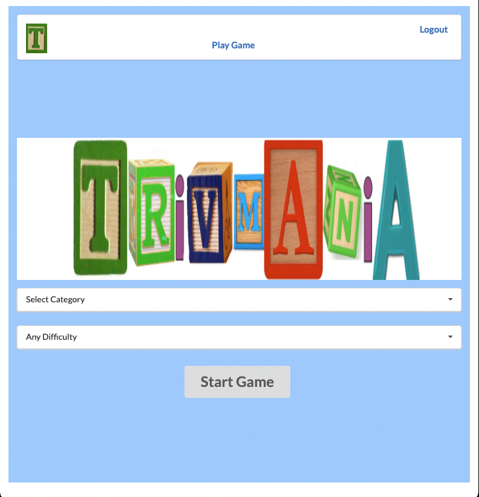
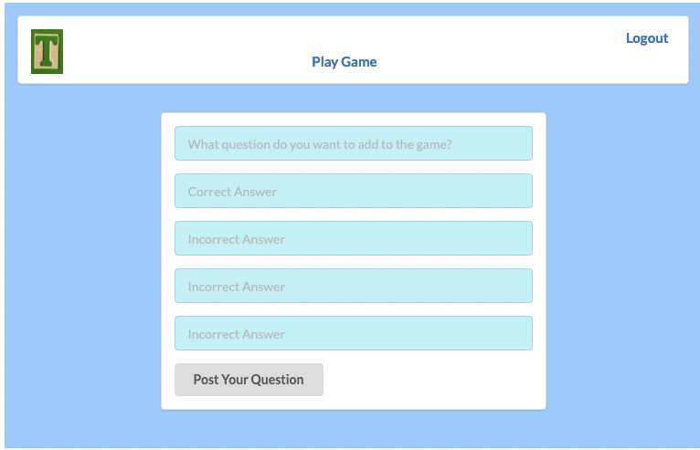
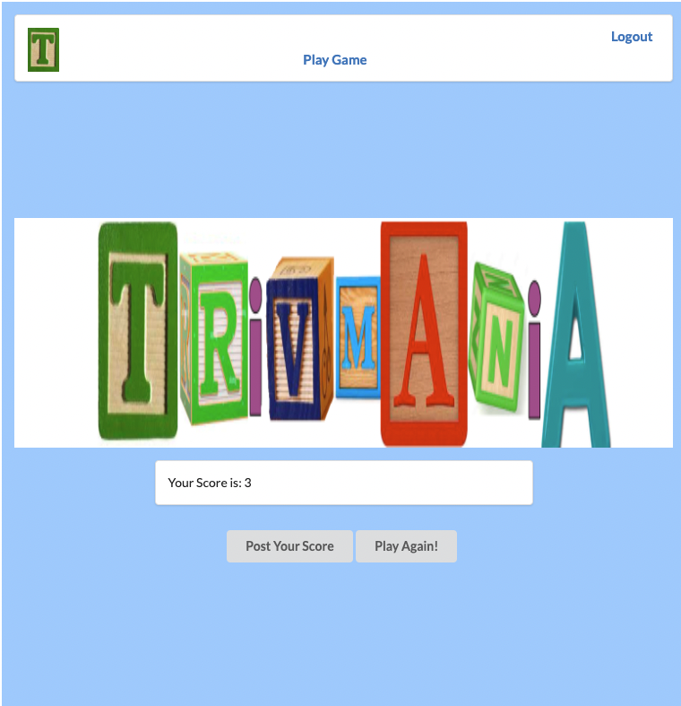
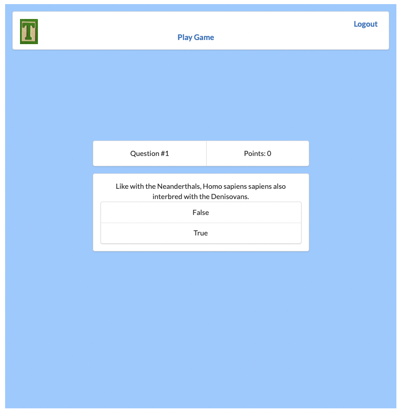

# TRIVMANIA

Welcome to my trivia app!

There is a game function that allows you to choose a category and difficulty of questions (accessed through the Open Trivia DB API).  This then populates 10 questions for your game instance that you will be able to see, along with possible answers that you will be able to select.  After you select an answer, you will visually see all of the wrong answers in red, correct answer in green, your points will update if you are correct, and then you can continue to the next question by pressing 'NEXT'.

You will also be able to interact with other users through the community page.  Here you can post new questions you would like to see included in the app and then others can vote if they like it!  On your profile, all of your questions will be listed.  Future functionality will allow you to also post your scores from the game.

My 6 year old actually came up with the name and logo idea!  He is very proud of it!  😄 

##### Getting Started

[Deployed Link](https://dead-pear-harp-seal-hem.cyclic.app/)

[Planning Materials](https://trello.com/b/mFz2jGIt/project-4)

#### Technologies Used

* Javascript
* React
* Node
* Express
* MongoDB
* Mongoose
* HTML
* CSS
* Semantic UI

##### Screenshots

#### Next Steps - Icebox Items

* Add and remove "friends" to easily access from your profile
* Post scores to your profile after you finish a game
* Updates on aesthetics
* Incorporate user questions into a new category that can be played
